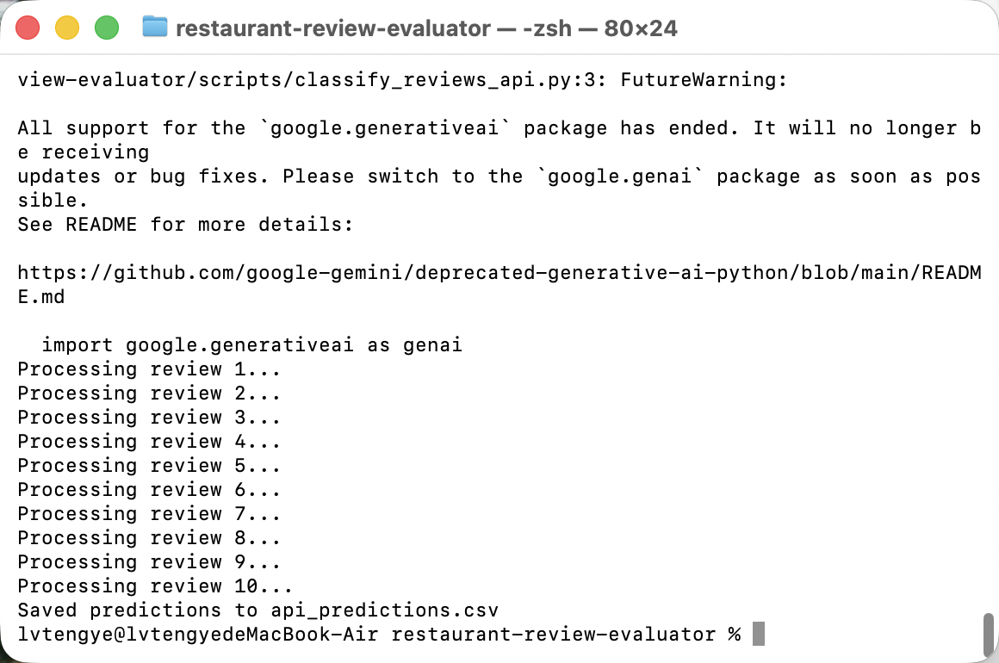
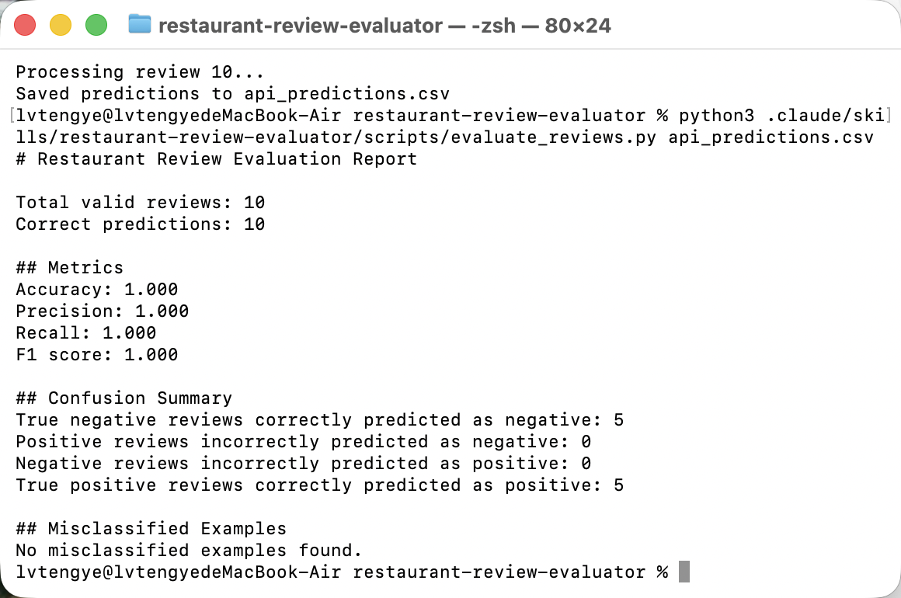

# Restaurant Review Evaluator Skill

---

# 1. Context, User, and Problem

## Who the User Is

The target user is a restaurant manager who receives customer reviews from multiple platforms. Modern restaurants operate both online and offline, so they collect feedback from many channels such as Uber Eats, DoorDash, Google Maps, Yelp, and the restaurant’s own website. 

As a result, managers face increasing difficulty in keeping up with and understanding customer feedback across platforms.

---

## What Workflow This Project Improves

This project improves the workflow of restaurant review monitoring and sentiment analysis.

The workflow begins when customer reviews are collected from different online and offline channels. The reviews are then cleaned, organized, classified by sentiment, and prioritized for managerial action. 

The system focuses especially on identifying negative reviews related to:
- food quality
- service quality
- delivery experience
- long waiting times

The workflow ends when reviews are labeled and summarized so managers can quickly identify operational problems and decide what actions to take.

---

## Why This Workflow Matters

Modern restaurants receive large amounts of customer feedback every day, and manual review is slow and inconsistent. If negative reviews are missed, managers may fail to notice problems in food quality, service, or delivery in time. 

This project matters because many customer reviews contain:
- sarcasm
- indirect complaints
- mixed sentiment
- multilingual expressions

Simple keyword-based systems often fail in these situations.

For example, a review such as:

> “Absolutely love getting cold fries after waiting forever.”

contains positive words like “love,” but actually expresses customer dissatisfaction. A language model can better understand the real meaning behind the review compared to a simple keyword-based baseline. 

Improving this workflow helps restaurant managers:
- respond faster to customer complaints
- identify operational problems earlier
- improve customer satisfaction
- protect restaurant ratings across platforms
- reduce the amount of manual review work

---

# 2. Solution and Design

## What I Built

I built a GenAI-powered restaurant review sentiment evaluation workflow using the Gemini API and Python evaluation scripts.

The system takes restaurant customer reviews from a CSV dataset, sends each review to the Gemini API for sentiment classification, and then evaluates the prediction quality using deterministic Python computation.

The workflow combines:
- LLM-based sentiment understanding
- structured CSV processing
- deterministic evaluation metrics
- business-oriented reporting

The goal is to help restaurant managers quickly identify negative customer feedback and operational problems without manually reading every review.

---

## System Workflow

```text
Customer Reviews CSV
        │
        ▼
Review Cleaning & Formatting
        │
        ▼
Gemini API Sentiment Classification
        │
        ▼
Structured Prediction Output
(api_predictions.csv)
        │
        ▼
Python Evaluation Script
        │
        ▼
Metrics + Error Analysis Report
```

---

## How the System Works

### Two important command：
1. python3 .claude/skills/restaurant-review-evaluator/scripts/classify_reviews_api.py
  The workflow will generate sentiment predictions through the Gemini API.
2. python3 .claude/skills/restaurant-review-evaluator/scripts/evaluate_reviews.py api_predictions.csv
  Python performs deterministic evaluation to ensure reproducible metrics.

### Step 1 — Review Input

The workflow begins with a CSV file containing restaurant reviews collected from multiple platforms such as:
- Uber Eats
- DoorDash
- Google Maps
- Yelp

Each review contains:
- review text
- platform source
- true sentiment label

This reflects the real workflow restaurant managers face when monitoring customer feedback across platforms.

---

### Step 2 — Review Cleaning and Formatting

Before classification, the system organizes reviews into a consistent format.

The preprocessing step:
- removes formatting inconsistencies
- standardizes text structure
- validates required columns
- prepares the reviews for API processing

This step is important because reviews from different platforms often contain inconsistent formatting, emojis, slang, or noisy text. 

---

### Step 3 — Gemini API Classification

The core GenAI component uses the Gemini API to classify sentiment.

The script:

```bash
scripts/classify_reviews_api.py
```

sends each review to the Gemini model with a structured prompt.

Example prompt:

```text
Classify the sentiment of this restaurant review.

Only answer:
positive
or
negative
```

The model then predicts:
- positive
- negative

This design intentionally constrains the output format to improve consistency and reduce unpredictable responses.

The system uses GenAI because restaurant reviews often contain:
- sarcasm
- indirect complaints
- mixed sentiment
- informal language

For example:

> “Absolutely love getting cold fries after waiting forever.”

A keyword-based baseline may incorrectly focus on the word “love” and classify the review as positive, while the language model is more likely to understand the hidden negative sentiment.

---

## Key Design Choices

### 1. Using an LLM Instead of Keywords

A major design choice was using a language model instead of a simple keyword-based classifier.

Keyword systems fail when:
- sentiment is indirect
- reviews contain sarcasm
- positive and negative opinions are mixed together
- wording depends on context

The Gemini API provides stronger contextual understanding for real restaurant review data.

---

### 2. Separating Classification and Evaluation

Another important design choice was separating:
- GenAI reasoning
- deterministic metric computation

The Gemini API handles natural language understanding, while Python handles:
- accuracy calculation
- precision
- recall
- F1 score
- confusion matrix analysis

This separation improves reliability because mathematical evaluation should not rely on free-form LLM reasoning alone.

---

### 3. Structured Output Design

The API output is converted into a structured CSV format:

```text
review_id
review_text
true_label
predicted_label
```

This design makes:
- evaluation reproducible
- downstream analysis easier
- aggregation possible
- business reporting clearer

---

### 4. Security and API Protection

The Gemini API key is stored in:

```text
.env
```

The `.env` file is excluded through:

```text
.gitignore
```

This prevents accidental exposure of private API credentials on GitHub.

---

## Technologies Used

- Python
- Gemini API
- pandas
- csv
- dotenv

---

## Why This Design Matters

This workflow demonstrates how GenAI can support a real business workflow instead of functioning only as a general chatbot or text-generation tool.

Modern restaurants receive large volumes of customer feedback from many online and offline platforms every day. Manually reading and organizing all reviews is time-consuming, inconsistent, and difficult to scale. As review volume increases, restaurant managers may miss important negative feedback related to food quality, service quality, delivery delays, or customer experience.

This system improves that workflow by combining:
- language understanding from the Gemini API
- deterministic evaluation from Python
- structured reporting for operational analysis

The Gemini API is responsible for understanding review meaning and context. This is important because restaurant reviews are often informal, emotional, sarcastic, or indirectly negative. A traditional keyword-based system may fail when customers use positive words sarcastically or mix positive and negative opinions in the same sentence.

For example:

> “Absolutely love getting cold fries after waiting forever.”

A simple keyword-based classifier may incorrectly focus on the word “love” and classify the review as positive. In contrast, the Gemini model is more likely to understand that the customer is actually complaining about cold food and long wait times.

The Python evaluation pipeline then performs deterministic computation for:
- accuracy
- precision
- recall
- F1 score
- confusion matrix analysis

This separation of responsibilities is an important design decision. The language model handles interpretation and contextual understanding, while Python handles mathematical evaluation in a consistent and reproducible way. This reduces the risk of unreliable metric calculations from free-form LLM reasoning.

The workflow also produces structured outputs that are easier for restaurant managers to use in practice. Instead of reading hundreds of raw reviews, managers can quickly:
- identify negative reviews
- prioritize customer complaints
- detect common operational issues
- compare performance across platforms
- recognize recurring problems such as delivery delays or food quality complaints

Another important aspect of this design is human oversight. The system is designed to support managerial decision-making, not replace it. While the model can help identify potentially negative reviews, it should not automatically make decisions such as customer refunds, employee punishment, or operational policy changes without human review. This is especially important for ambiguous, sarcastic, or mixed-sentiment reviews.

To sum up, this project demonstrates how GenAI can be integrated into a scalable business workflow that combines language understanding, structured processing, deterministic evaluation, and human oversight to improve restaurant review analysis and operational awareness.

---

# 3. Evaluation and Results

## Baseline Comparison

The project was compared against a simpler non-API baseline workflow.

Baseline approach:
- manually reading reviews
- manually assigning positive or negative labels
- no automated evaluation metrics
- no structured reporting
- inconsistent classification quality between users

The GenAI workflow improved this process by:
- automatically classifying reviews using the Gemini API
- generating consistent sentiment predictions
- computing deterministic evaluation metrics with Python
- producing structured reports for business analysis

This created a faster and more scalable workflow for restaurant review monitoring.

---

## Test Cases and Evaluation Criteria

The evaluation used the dataset:

`restaurant_reviews_120.csv`

Dataset characteristics:
- 120 restaurant reviews
- balanced sentiment distribution
- positive and negative labels
- realistic customer review language
- mixed review lengths and writing styles

The evaluation focused on:
- Accuracy
- Precision
- Recall
- F1 Score
- Confusion Matrix
- Misclassified Examples

The workflow was tested using:
1. Gemini API sentiment classification
2. CSV prediction generation
3. Python-based deterministic evaluation

---

## Evaluation Workflow

The workflow first used the Gemini API to classify restaurant reviews.

The screenshot below shows the API workflow processing restaurant reviews and generating sentiment predictions.



After prediction generation, the evaluation script compared the predicted labels against the ground-truth labels stored in the CSV dataset.

The system automatically calculated:
- total valid reviews
- correct predictions
- precision
- recall
- F1 score
- confusion matrix statistics
- misclassified examples

This combination of GenAI and deterministic Python evaluation ensured both language understanding and reliable metric computation.

---

## What I Found

The screenshot below shows the evaluation output generated by the Python evaluation script.



The evaluation showed:
- 10 valid reviews tested during the API workflow run
- 10 correct predictions
- Accuracy = 1.000
- Precision = 1.000
- Recall = 1.000
- F1 Score = 1.000

The confusion matrix showed:
- 5 true negative predictions
- 5 true positive predictions
- 0 false positives
- 0 false negatives

The workflow successfully demonstrated:
- reliable API integration
- automated sentiment classification
- deterministic evaluation
- structured reporting

The project also showed why GenAI should still be combined with deterministic systems. While Gemini handled natural language understanding, Python ensured that evaluation metrics remained accurate and reproducible.

---
# 4. Artifact snapshot: 

## Video Link: 

---

## Limitations

The current evaluation only used a small subset during API testing to reduce API cost and execution time.

The workflow may still face challenges with:
- sarcasm
- ambiguous reviews
- mixed sentiment reviews
- extremely short customer comments

Human review may still be necessary for edge cases and operational decisions.